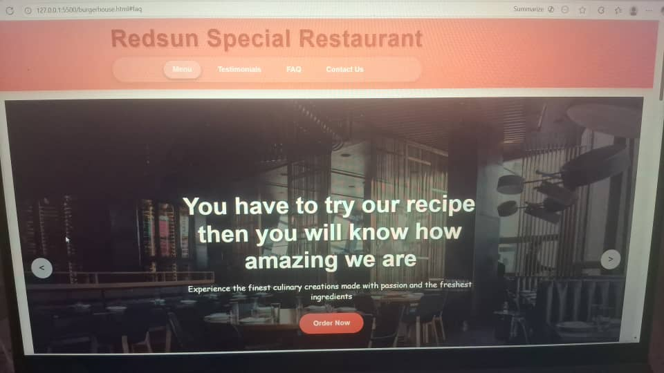

# ☕ The Coffee Corner

A responsive and modern website for "The Redsun Fastfood," a cozy cafe house. This website showcases the Fastfood's menu, ambiance, location, and contact information, providing an engaging online presence for customers.

 <!-- Replace with your actual screenshot path -->

## 🚀 Live Demo

[View the live website here!](https://fanitu.github.io/burgerHouse/burgerhouse.html) <!-- Replace with your GitHub Pages URL -->

## ✨ Features

- *Fully Responsive:* Looks great on desktops, tablets, and mobile phones.
- *Modern UI/UX:* Clean and visually appealing design with a warm, inviting color scheme.
- *Interactive Menu:* A well-organized menu section displaying Foods, Juices, and Others.
- *Gallery:* A visual showcase of the FastFood's atmosphere and products.
- *Contact Information & Map:* Easy-to-find location and contact details.
- *Online Reservation Form:* (If you have one) A form for customers to book a table.

## 🛠 Built With

This project was built using the following technologies:

*   **[HTML5](https://developer.mozilla.org/en-US/docs/Web/HTML):** For the structure and content of the website.
*   **[CSS3](https://developer.mozilla.org/en-US/docs/Web/CSS):** For styling, including Flexbox/Grid for layout and animations.
*   **[JavaScript](https://developer.mozilla.org/en-US/docs/Web/JavaScript):** (Optional) For any interactive elements (e.g., image sliders, form validation).

## 📦 Installation & Setup

If you want to run this project locally on your machine, follow these steps:

1.  *Clone the repository:*
    bash
    git clone (https://fanitu.github.io/burgerHouse)
    
2.  *Navigate to the project directory:*
    bash
    cd your-burgerHouse
    
3.  *Open the project in your code editor:*
    bash
    code .  # This command works if you have VS Code installed
    
4.  **Open the burgerhouse.html file in your web browser:**
    - You can simply double-click the burgerhouse.html file, or
    - Use a live server extension in VS Code for a better development experience.

## 🎯 Project Structure